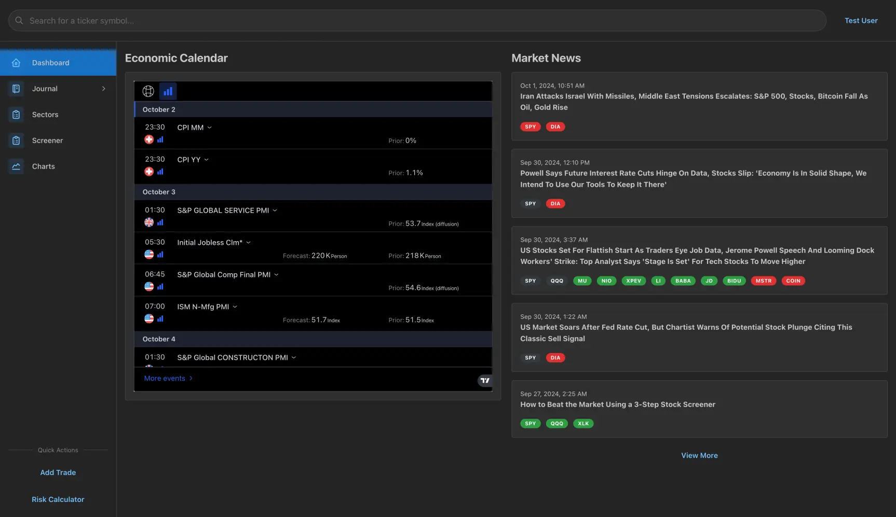
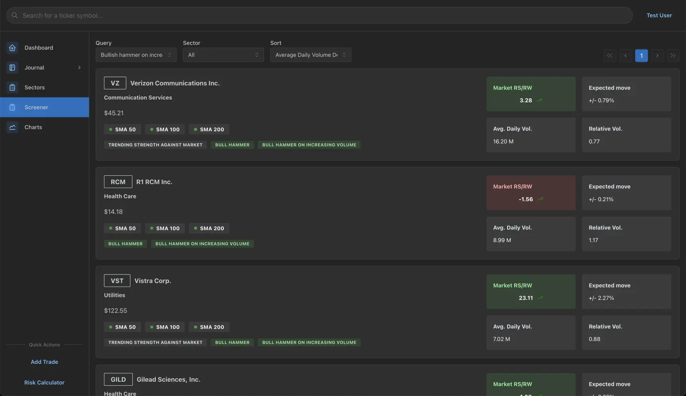
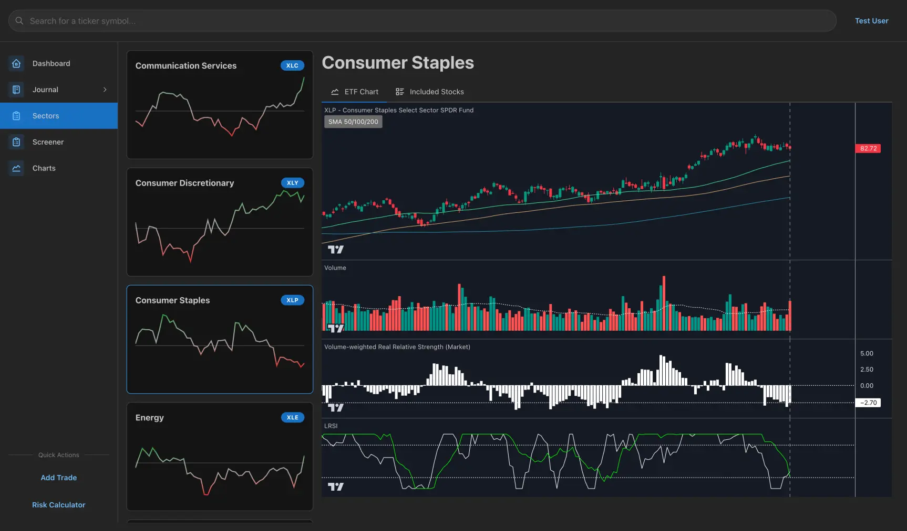
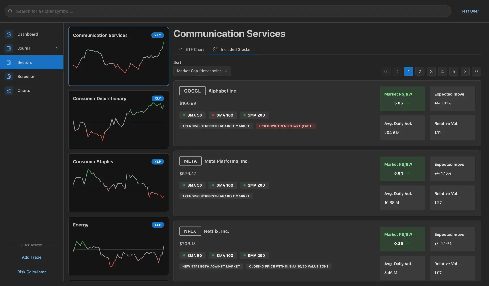
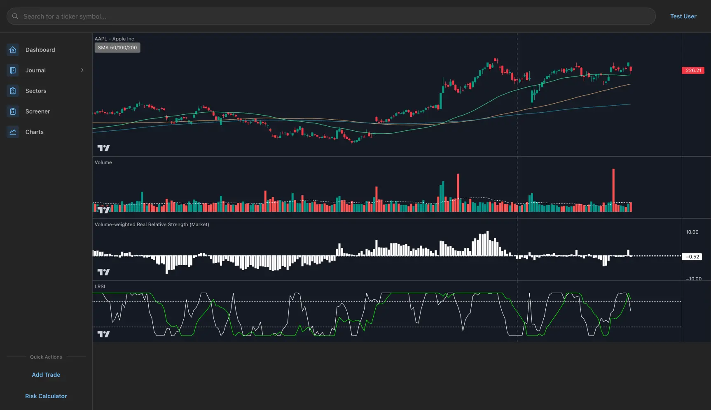
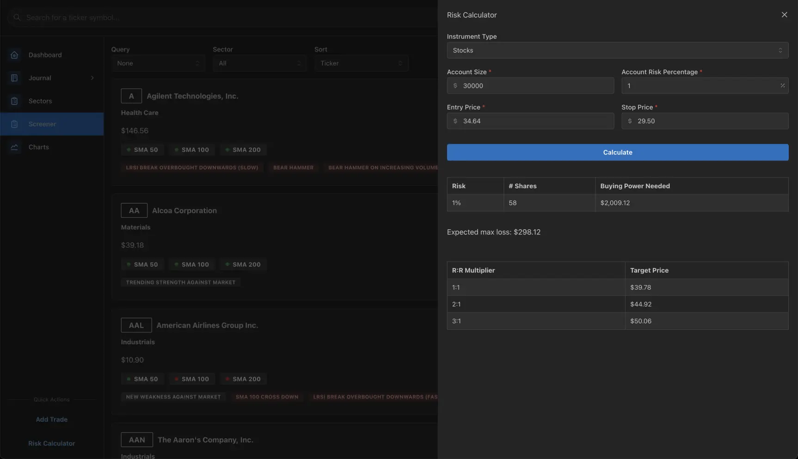
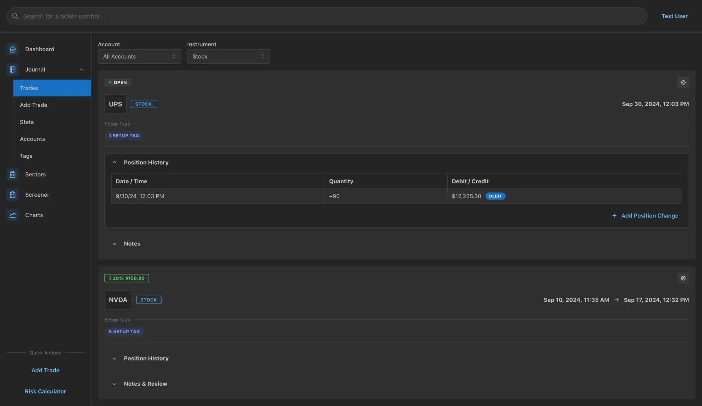
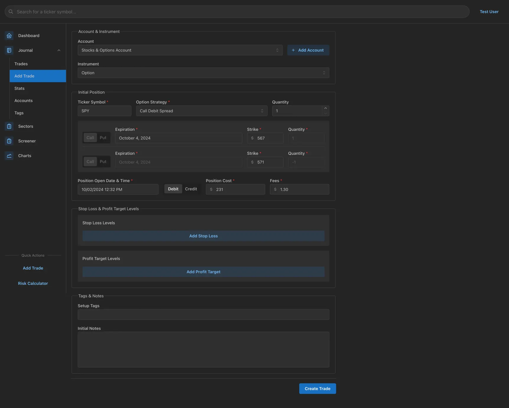

# Trading Assistant

Trading Assistant is a web application designed to assist financial market traders with market analysis and provide journaling functionality. At the root of the analysis in Trading Assistant is the concept of relative strength and weakness of individual securities against a benchmark security in the market, which by default is the S&P 500 ETF `$SPY`. The goal with this type of analysis is to identify early-stage institutional buying or selling. The application is currently focused on the analysis of daily data and can be used to help locate potential swing trades.

DISCLAIMER: This application provides functionality used in analyzing public finacial market data. It does not offer any sort of financial advice or recommendations. Any financial decisions you make based on your interpretation of the data presented are your own responsibility.

## Packages

The project is separated into several packages contained within this repo in the `packages` path:

### Server

This package contains the Trading Assistant server application. It is responsible for managing market data, managing journal data, providing a REST API for user authentication, and providing a GraphQL API for all other requests. Written in [TypeScript](https://www.typescriptlang.org/), it runs on [Node.js](https://nodejs.org/en) and makes use of the [NestJS](https://nestjs.com/) framework.

### Web Client

This package contains the Trading Assistant web client application. It is a browser-based frontend application for the project and is written in [TypeScript](https://www.typescriptlang.org/) and [React](https://react.dev/).

### Common

This package contains shared code used by the other packages such as general utilities, TypeScript types, and validation schemas.

## Screenshots

###### Dashboard

###### Daily Screener

###### Sectors (with chart)

###### Sectors (with stocks)

###### Chart

###### Risk Calculator

###### Journal List

###### Create Journal Trade

## Roadmap

#### General

-   [ ] Locate a reliable source for earnings data. This will allow for anchored VWAP points to be placed at those earnings dates and useful in additional analysis.
-   [ ] Add support for multiple timeframe analysis. The week period data is currently being tracked, but it's not used in analysis yet.
-   [ ] Analyze relative strength/weakness values to find deviations from the average rate of change. The idea is to have a moving average that tracks the period-to-period delta values of relative strength/weakness and look for the ticker symbols that are above their average by a significant amount. This could be used to identify the start of an institutional buying or selling trend.

#### Server

-   [ ] Optimize data analysis process
-   [ ] Add support for Docker to get up and running faster with `docker compose`
-   [ ] Add a CLI task to replace all period data for a ticker symbol. Currently, handling stock splits is not automated and this is necessary for the manual process of updating the affected symbol data.

#### Web Client

-   [ ] Re-design the trades list page to make better use of space and ensure that more trades are visible by default

## License

Distributed under the AGPL License. See [`LICENSE.txt`](LICENSE.txt) for more information.

## Contact

Doug Frei - [doug@dougfrei.com](mailto:doug@dougfrei.com)

Project Link: [https://github.com/dougfrei/trading-assistant](https://github.com/dougfrei/trading-assistant)
