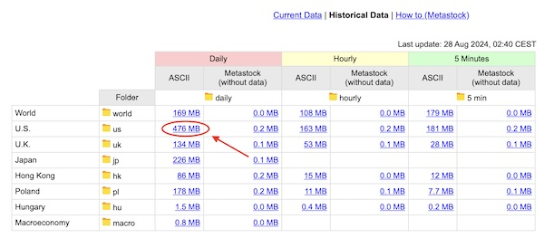

# Trading Assistant - Server

This package contains the Trading Assistant server application. It is responsible for managing market data, managing journal data, providing a REST API for user authentication, and providing a GraphQL API for all other requests. Written in [TypeScript](https://www.typescriptlang.org/), it runs on [Node.js](https://nodejs.org/en) and makes use of the [NestJS](https://nestjs.com/) framework.

## Requirements

-   Node.js (v22+)
-   PostgreSQL (tested with v16)
-   Redis (tested with v7)
-   SMTP server for sending mail used during user creation. [Mailcatcher via Docker](https://hub.docker.com/r/sj26/mailcatcher) is a great option for local development and testing.
-   [FMP](https://site.financialmodelingprep.com/), [FMPCloud](https://fmpcloud.io/), and [Polygon.io](https://polygon.io/) API keys. The free tiers are fine for all of these services.
-   [Alpaca](https://alpaca.markets/) API key is optional and currently exists within this project as an inactive backup data source.

## Installation and configuration

Please note that [pnpm](https://pnpm.io/) is the recommended package manager for this project and will be used in all commands listed below.

```bash
# Install the project dependencies
$ pnpm install

# Copy .env.example to .env (make sure to configure the values in .env)
$ cp .env.example .env

# Initialize the database (you'll be asked to create the default admin user)
$ pnpm run cli db-migrate latest
```

## Initial data import using the CLI

The initial data setup is done via an archive downloaded from [Stooq](https://stooq.com/db/h/). Download the "U.S. Daily ASCII" archive as shown here:



Run the following commands after the archive has been downloaded:

```bash
# Import data from the archive so that ticker symbols and candle data are created
$ pnpm run cli import-bulk-candle-data <path-to-stooq-archive.zip>

# Associate sector data with the ticker symbol records
$ pnpm run cli associate-sectors

# Update the NYSE market holidays schedule
$ pnpm run cli update-nyse-market-holidays

# Run the initial candle analysis process
$ pnpm run cli analyze-candles
```

## Updating daily candle data

Daily candle data updates are sourced using Polygon.io. When run, the `import-daily-candle-data` CLI task listed below will automatically determine the next open market day based on the current data from the DB and request the candle data for it.

Note that when using the Polygon.io free tier, data will not be available until 12:00am ET of the next day and requests to retrieve it before then will fail.

```bash
# Import the next available open market day daily candle data from Polygon.io
$ pnpm run cli import-daily-candle-data

# Run candle analysis process
$ pnpm run cli analyze-candles
```

## Running the app

```bash
# development
$ pnpm run start

# watch mode
$ pnpm run start:dev

# production mode
$ pnpm run start:prod
```

## Running tests

```bash
# unit tests
$ pnpm run test
```

## Custom Analyzers and CLI tasks

The Trading Assistant server is built so that custom analyzers and CLI tasks can be easily added without needing to make changes to the repository.

It is recommended to place your custom analyzers and CLI tasks in the `local-content` folder at the root of this project, which is a folder that does not have its contents tracked within git.

### Creating an Analyzer

The process of implementing a custom analyzer requires a class that extends `BaseAnalyzer` and overrides the `createCommanderTask` method:

```typescript
// local-content/analyzers/custom-analyzer.ts
import BaseAnalyzer from 'src/analysis/BaseAnalyzer';
import { Candle } from 'src/entities/Candle.model';

class CustomAnalyzer extends BaseAnalyzer {
	constructor() {
		super();
	}

	analyze(candles: Candle[]): Candle[] {
		// process candles with analyzer logic

		return candles;
	}

	/*
	Additional methods that can be overridden include:

	getIndicatorTypes
	getAlertTypes
	getMainChartSeriesGroups
	getVolumeChartSeriesGroups
	getChartTypes
	getMinimumRequiredCandles
	*/
}

export default CustomAnalyzer;
```

After the analyzer class is created, it is necessary to create a custom config file at `config/analyzers.config.ts` that will append the custom analyzer to an array of existing analyzers:

```typescript
// config/analyzers.config.ts
import { ECandlePeriodType } from '@trading-assistant/common';
import IAnalyzerGroupParams from 'src/interfaces/IAnalyzerGroupParams';
import defaultAnalyzers from './analyzers.default.config';

const analyzers = {
	[ECandlePeriodType.D]: (params: IAnalyzerGroupParams) => [
		...defaultAnalyzers[ECandlePeriodType.D](params),
		new CustomAnalyzer({
			/* analyzer params */
		})
	],
	[ECandlePeriodType.W]: (params: IAnalyzerGroupParams) => [
		...defaultAnalyzers[ECandlePeriodType.W](params),
		new CustomAnalyzer({
			/* analyzer params */
		})
	]
};

export default analyzers;
```

It's worth understanding that you'll only need to add your analyzer to period type groups (the `ECandlePeriodType.D` and `ECandlePeriodType.W` keys referenced in the custom config) that require it. For example, if your analyzer is only meant to run on daily candles, it would only be necessary to add it to the `ECandlePeriodType.D` group.

After adding a custom analyzer, it will be necessary to run `pnpm run cli analyze-candles` so that the data generated by your analyzer is added to the candle records.

Additional documentation about creating custom analyzers will be coming in the future, but for the time being its recommended to look at the default analyzers in `src/analysis/analyzers` for implementation examples.

### Creating a CLI task

The process of implementing a custom CLI task requires a class that extends `CLITask` and overrides the `createCommanderTask` method:

```typescript
// local-content/cli-tasks/custom-cli-task.ts
import { Command } from 'commander';
import CLITask from 'src/cli/cli-task';

class CustomCLITask extends CLITask {
	protected createCommanderTask(program: Command): void {
		program
			.command('custom-cli-task')
			.description('description for the custom CLI task')
			.action(async () => {
				/* code for the custom CLI task */
			});
	}
}

export default CustomCLITask;
```

After the class is created, it is necessary to create a custom CLI tasks config file at `config/cli-tasks.config.ts` that will append the custom CLI tasks to an array of existing CLI tasks:

```typescript
// config/cli-tasks.config.ts
import CustomCLITask from 'local-content/cli-tasks/custom-cli-task';
import CLITask from 'src/cli/cli-task';
import defaultTasks from './cli-tasks.default.config';

const cliTasks: (typeof CLITask)[] = [...defaultTasks, CustomCLITask];

export default cliTasks;
```

Once these two steps are complete, the custom CLI task will be available by running `pnpm run cli custom-cli-task`

The default CLI tasks are located in `src/cli/tasks` for reference.

## Notes

-   `strictPropertyInitialization` is currently disabled in `tsconfig.json`. This is due to conflicts that arise with the [code-first GraphQL schema generation](https://docs.nestjs.com/graphql/quick-start#code-first) in NestJS where property initializers cause issues with AST generation.

## License

Distributed under the AGPL License. See [`LICENSE.txt`](LICENSE.txt) for more information.

## Contact

Doug Frei - [doug@dougfrei.com](mailto:doug@dougfrei.com)

Project Link: [https://github.com/dougfrei/trading-assistant](https://github.com/dougfrei/trading-assistant)
